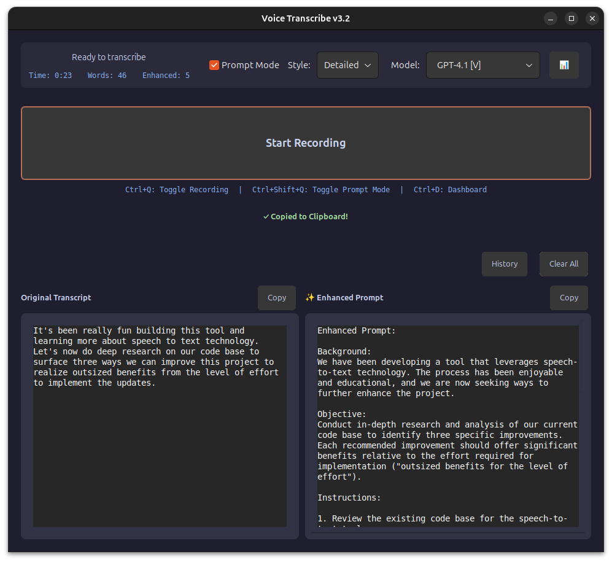

# Voice Transcribe v3.2 🎤

[](https://github.com/josephrclick/voice-transcribe/actions/workflows/ci.yml)

A delightfully simple voice-to-text tool for Linux that just works™. Click button, speak thoughts, get text. Now with ✨ Prompt Mode ✨ for AI-enhanced transcripts!

## What It Does (And Doesn't Do)

**What it does:**

- 🔴 One big button that says "Start Recording" (revolutionary, I know)
- ⏱️ Shows you how long you've been rambling
- 📊 Counts your words so you know if you're being verbose
- 📋 Auto-copies to clipboard because Ctrl+C is so 2023
- 🎨 Dark theme that won't burn your retinas at 3am
- ⌨️ Keyboard shortcuts: Ctrl+Q (record), Ctrl+Shift+Q (Prompt Mode), Ctrl+D (Dashboard)
- ✨ **NEW: Prompt Mode** - Transforms your rambling into perfect LLM prompts
- 🔄 **NEW: Dual copy buttons** - Copy original or enhanced separately
- 🚀 Actually works, which is more than I can say for my first 17 projects

**What it doesn't do:**

- 🤖 No AI listening to you 24/7 (that's for v4 when I wire up the house)
- 🎯 No Voice Activity Detection (turns out, buttons are fine)
- 🔮 No mind reading (yet)

## Screenshots

### GUI - Now with side-by-side panels and dual copy buttons!


_Left: Your actual words (with copy button). Right: What you meant to say (with its own copy button)._

## The Stack

- **GTK 3** - Because native Linux apps deserve love
- **Deepgram Nova-3** - The speech recognition that actually understands mumbling
- **OpenAI GPT-4.1 Family & GPT-5** - From economy to flagship tier models
- **Python** - The language of "let's just ship it"

## Installation

```bash
# Clone this bad boy
git clone https://github.com/josephrclick/voice-transcribe.git
cd voice-transcribe

# Install system dependencies first (required for PyGObject and audio)
sudo apt update
sudo apt install python3-gi python3-gi-cairo gir1.2-gtk-3.0 libgirepository-2.0-dev
sudo apt install libcairo2-dev python3-dev pkg-config  # Build dependencies for PyGObject
sudo apt install portaudio19-dev                       # Audio library for sounddevice

# System deps for clipboard greatness
sudo apt install xclip xdotool          # X11 users
sudo apt install wl-clipboard           # Wayland clipboard
sudo apt install wtype                  # Optional: Wayland auto-paste

# Virtual environment (because we're not savages)
python3 -m venv venv
source venv/bin/activate

# Install the goods
pip install -r requirements.txt

# Add your Deepgram key (get one free at deepgram.com)
echo "DEEPGRAM_API_KEY=your_key_here" > .env

# Add your OpenAI key for Prompt Mode (optional)
echo "OPENAI_API_KEY=sk-your_key_here" >> .env
```

## Usage

### The Simple Way

```bash
python main.py
```

Click the big button. Talk. Click again. Paste anywhere. You're welcome.

### The Pro Way

Set up the desktop launcher and Ctrl+Q hotkey:

```bash
# Automatic installation (recommended)
bash install-desktop-app.sh
```

This will:

- Create a desktop launcher with proper icon
- Install to your application menu
- Set up Ctrl+Q global hotkey (GNOME)
- Create command-line shortcut (if ~/.local/bin exists)

**Manual setup** (if automatic install doesn't work):

```bash
# Create desktop shortcut manually
cat > ~/.local/share/applications/voice-transcribe.desktop << EOF
[Desktop Entry]
Version=1.0
Type=Application
Name=Voice Transcribe v3.2
Comment=Speech to text, but cooler
Exec=$(pwd)/voice-transcribe
Icon=$(pwd)/images/icon.png
Terminal=false
Categories=Utility;Audio;
StartupNotify=true
EOF

# Set up Ctrl+Q global hotkey manually (GNOME)
# Go to Settings > Keyboard > Custom Shortcuts
# Add new shortcut:
#   Name: Voice Transcribe Toggle
#   Command: /path/to/voice-transcribe/voice-transcribe toggle
#   Shortcut: Ctrl+Q
```

## ✨ Prompt Mode - The Game Changer

Ever record a voice note and realize you sound like you're ordering coffee while solving world peace? Prompt Mode fixes that.

### What is Prompt Mode?

It's like having a tiny prompt engineer in your computer that takes your stream-of-consciousness rambling and turns it into the kind of prompt that makes LLMs go "Now THIS I can work with!"

### How it Works

1. **Enable Prompt Mode** - Check the box or hit Ctrl+Shift+Q
2. **Choose your style:**
   - **Concise**: For when you need to get to the point
   - **Balanced**: The Goldilocks zone of prompts
   - **Detailed**: For when you need the LLM to really get it
3. **Select your AI model** (NEW!):

## Available Models

| Model        | Context Window | Max Output | Features        | Tier     | Best For         |
| ------------ | -------------- | ---------- | --------------- | -------- | ---------------- |
| GPT-4o Mini  | 128K           | 4,096      | JSON            | Standard | Quick edits      |
| GPT-4.1 Nano | 1M             | 2,048      | JSON, Verbosity | Economy  | High volume      |
| GPT-4.1 Mini | 1M             | 4,096      | JSON, Verbosity | Economy  | Longer texts     |
| GPT-4.1      | 1M             | 8,192      | JSON, Verbosity | Standard | Professional     |
| GPT-5 Nano   | 400K           | 128,000    | All features    | Economy  | Fast processing  |
| GPT-5 Mini   | 400K           | 128,000    | All features    | Standard | Creative writing |
| GPT-5        | 400K           | 128,000    | All features    | Flagship | Complex tasks    |

- **Flagship tier models** offer advanced reasoning capabilities
- **Context windows**: 128K = ~96K words, 400K = ~300K words, 1M = ~750K words
- **All models** include automatic fallback chains for reliability
- Model selection persists between sessions with intelligent fallback handling

4. **Speak naturally** - "um, so like, I need a function that, you know, reads CSVs and stuff"
5. **Watch the magic** - See a preview while it enhances: "Enhancing: um, so like, I need a function that..."
6. **Get enhanced** - "Create a Python function that reads CSV files, handles encoding issues, and provides error handling with clear documentation"
7. **Copy what you need** - Separate copy buttons for original and enhanced versions

### Side-by-Side View

See your original transcript next to the enhanced version. It's like watching your thoughts get a makeover.

### 📊 Performance Dashboard

Access comprehensive model information and usage statistics with **Ctrl+D**:

- **Model Specifications**: Detailed context windows, output limits, and feature support matrix
- **Performance Metrics**: Real-time speed comparisons and latency estimates
- **Usage Statistics**: Session costs and model usage tracking across all tiers
- **Tier Classifications**: Economy, Standard, and Flagship model comparisons
- **Context Explanations**: Human-readable descriptions of model capabilities

The dashboard helps you choose the optimal model for specific use cases and understand the trade-offs between speed, capability, and cost.

### Example Transformations

```
Original: "can you help me fix this react thing where it keeps rerendering constantly and I don't know why"
Enhanced: "Debug React component excessive rerendering issue. The component rerenders continuously without apparent state changes. Please analyze potential causes and provide solutions."

Original: "write a python script that uh reads all the json files in a folder and combines them but only if they have a status field that's active"
Enhanced: "Create a Python script with these requirements:
- Read all JSON files from a specified directory
- Filter files where 'status' field equals 'active'
- Combine filtered data into a single output
- Include error handling for invalid JSON"
```

## Why v3.2?

- v1: "Hey, this could work!" (Narrator: it didn't)
- v2: "Let's add ALL the features!" (Spoiler: too many features)
- v3: "What if we just... made it work?" (Revolutionary concept)
- v3.1: "What if your rambling made sense?" (Game changer)
- v3.2: "What if we made it even smoother?" (Quick wins ftw)

## Features That Actually Exist

### 🎨 Dark Theme

Because your eyes matter. Carefully crafted with Catppuccin-inspired colors that say "I code at night and I'm proud of it."

### 📊 Real-time Stats

Watch the seconds tick by and words accumulate. It's like a fitness tracker, but for your mouth.

### 🔄 Action Buttons

- **Copy (Original)**: Get your raw, unfiltered thoughts
- **Copy (Enhanced)**: Get the polished version
- **Clear All**: For when you need a fresh start

### 🎯 Auto-paste

On X11, it'll even paste for you via xdotool. On Wayland, install `wtype` for automatic pasting (otherwise use Ctrl+V).

### 🔝 Always On Top

Stays visible because out of sight, out of mind, and we can't have that.

### ⌨️ Keyboard Shortcuts

- **Ctrl+Q**: Toggle recording (works globally with desktop setup)
- **Ctrl+Shift+Q**: Toggle Prompt Mode instantly
- **Ctrl+D**: Open Performance Dashboard with comprehensive model information

## Troubleshooting

**"It's not recording!"**

- Is your mic plugged in? (I'm not judging)
- `pactl list short sources` - pick a working one
- `pactl set-default-source <that_working_one>`

**"Where's my transcript?"**

- Did you actually say something?
- Check your Deepgram API key
- Is the internet on?

**"Auto-paste isn't working!"**

- Using Wayland? Install `wtype` for auto-paste or use Ctrl+V.
- On X11? Make sure xdotool is installed and you clicked where you want to paste

**"I see GTK warnings!"**

- They're like participation trophies - everyone gets them, nobody wants them
- `export GTK_THEME=Adwaita` if they really bug you

**"Prompt Mode isn't working!"**

- Did you add your OpenAI API key to .env?
- Check if you have OpenAI credits
- If enhancement fails, you still get the original transcript

## What's NOT Coming Soon

- 🎯 VAD (Voice Activity Detection) - Buttons are fine, actually
- 🤖 AI house assistant integration - That's a different repo
- 🧠 Mind reading API - Still in alpha at Neuralink

## What Might Come Eventually

- 📝 History of your ramblings (and their enhanced versions)
- 🌍 More language support
- 🤖 More AI models (GPT-5 ready when it drops!)
- 📊 A/B testing dashboard to compare model performance
- 🎨 Theme customization (for the 3 people who don't like dark mode)
- 🤖 Direct LLM integration (skip the copy/paste dance)
- 🎯 Smart routing to different LLMs based on prompt type
- 💡 Context injection from clipboard/project files
- ☁️ Cloud sync (just kidding, everything stays local)

## Credits

- **Deepgram** - For the API that actually works
- **OpenAI** - For making my rambling coherent
- **Coffee** - For making this possible
- **That one Stack Overflow answer** - You know the one

## License

Do whatever you want with it. If it breaks, you get to keep both pieces.

---

_Built with ❤️ and mild frustration by someone who just wanted to dictate text without opening Google Docs_

_"Simplicity is the ultimate sophistication" - Leonardo da Vinci (who probably would've loved voice transcription)_
