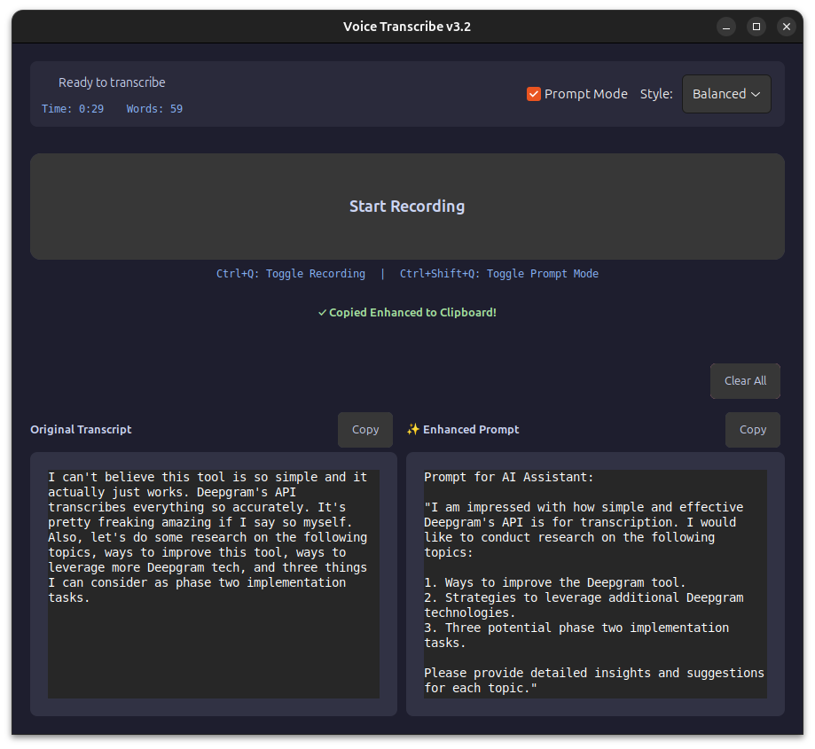

# Voice Transcribe v3 🎤

A delightfully simple voice-to-text tool for Linux that just works™. Click button, speak thoughts, get text. It's like magic, but with more Python.

## What It Does (And Doesn't Do)

**What it does:**
- 🔴 One big button that says "Start Recording" (revolutionary, I know)
- ⏱️ Shows you how long you've been rambling
- 📊 Counts your words so you know if you're being verbose
- 📋 Auto-copies to clipboard because Ctrl+C is so 2023
- 🎨 Dark theme that won't burn your retinas at 3am
- ⌨️ Ctrl+Q toggle support (for the keyboard warriors)
- 🚀 Actually works, which is more than I can say for my first 17 projects

**What it doesn't do:**
- 🤖 No AI listening to you 24/7 (that's for v4 when I wire up the house)
- 🎯 No Voice Activity Detection (turns out, buttons are fine)
- 🔮 No mind reading (yet)

## Screenshots

### GUI - that's it. This is all there is.


## The Stack

- **GTK 3** - Because native Linux apps deserve love
- **Deepgram Nova-3** - The speech recognition that actually understands mumbling
- **Python** - The language of "let's just ship it"

## Installation

```bash
# Clone this bad boy
git clone https://github.com/josephrclick/voice-transcribe.git
cd voice-transcribe

# Virtual environment (because we're not savages)
python3 -m venv venv
source venv/bin/activate

# Install the goods
pip install -r requirements.txt

# System deps for clipboard greatness
sudo apt install xclip xdotool  # X11 users
sudo apt install wl-clipboard    # Wayland folks

# Add your Deepgram key (get one free at deepgram.com)
echo "DEEPGRAM_API_KEY=your_key_here" > .env
```

## Usage

### The Simple Way
```bash
python main.py
```

Click the big button. Talk. Click again. Paste anywhere. You're welcome.

### The Pro Way
Set up the desktop launcher and Ctrl+Q hotkey:

```bash
# Create desktop shortcut
cat > ~/.local/share/applications/voice-transcribe.desktop << EOF
[Desktop Entry]
Version=1.0
Type=Application
Name=Voice Transcribe v3
Comment=Speech to text, but cooler
Exec=bash -c "cd $HOME/voice-transcribe && source venv/bin/activate && python main.py"
Icon=audio-input-microphone
Terminal=false
Categories=Utility;Audio;
StartupNotify=true
EOF

# Set up Ctrl+Q global hotkey (GNOME example)
# Go to Settings > Keyboard > Custom Shortcuts
# Command: bash -c "cd $HOME/voice-transcribe && source venv/bin/activate && python main.py toggle"
```

## Why v3?

- v1: "Hey, this could work!" (Narrator: it didn't)
- v2: "Let's add ALL the features!" (Spoiler: too many features)
- v3: "What if we just... made it work?" (Revolutionary concept)

## Features That Actually Exist

### 🎨 Dark Theme
Because your eyes matter. Carefully crafted with Catppuccin-inspired colors that say "I code at night and I'm proud of it."

### 📊 Real-time Stats
Watch the seconds tick by and words accumulate. It's like a fitness tracker, but for your mouth.

### 🔄 Action Buttons
- **Copy**: In case the auto-copy wasn't enough
- **Clear**: For when you realize what you just said

### 🎯 Auto-paste (X11)
On X11, it'll even paste for you. On Wayland? Well, Ctrl+V isn't that hard.

### 🔝 Always On Top
Stays visible because out of sight, out of mind, and we can't have that.

## Troubleshooting

**"It's not recording!"**
- Is your mic plugged in? (I'm not judging)
- `pactl list short sources` - pick a working one
- `pactl set-default-source <that_working_one>`

**"Where's my transcript?"**
- Did you actually say something?
- Check your Deepgram API key
- Is the internet on?

**"Auto-paste isn't working!"**
- Using Wayland? That's a feature, not a bug. Use Ctrl+V.
- On X11? Make sure xdotool is installed and you clicked where you want to paste

**"I see GTK warnings!"**
- They're like participation trophies - everyone gets them, nobody wants them
- `export GTK_THEME=Adwaita` if they really bug you

## What's NOT Coming Soon

- 🎯 VAD (Voice Activity Detection) - Buttons are fine, actually
- 🤖 AI house assistant integration - That's a different repo
- 🧠 Mind reading API - Still in alpha at Neuralink

## What Might Come Eventually

- 📝 History of your ramblings
- 🌍 More language support
- 🎨 Theme customization (for the 3 people who don't like dark mode)
- ☁️ Cloud sync (just kidding, everything stays local)

## Credits

- **Deepgram** - For the API that actually works
- **Coffee** - For making this possible
- **That one Stack Overflow answer** - You know the one

## License

Do whatever you want with it. If it breaks, you get to keep both pieces.