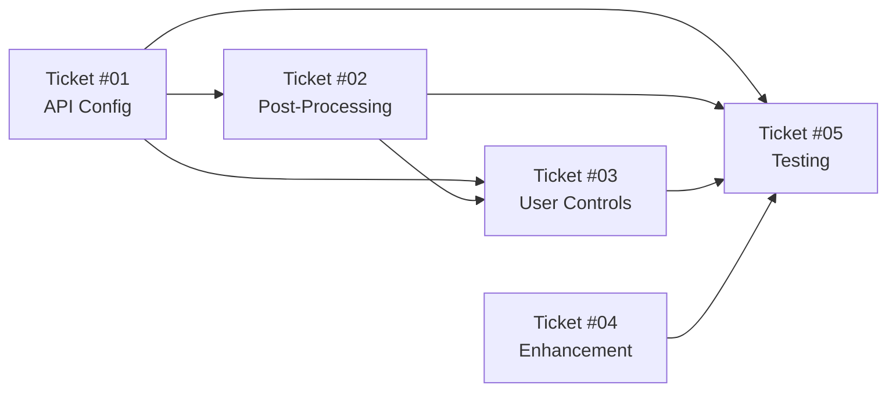

# Punctuation Sprint Overview

## Executive Summary

This sprint addresses the critical over-punctuation issue in the voice transcription application where users experience fragmented sentences due to hardcoded Deepgram API settings and lack of intelligent post-processing.

**Problem**: Voice transcription adds too many sentence-ending punctuation marks when users take minor pauses, resulting in output like "Hello. World. Today. Is. Great." instead of "Hello world, today is great."

**Solution**: Multi-layered approach combining API configuration improvements, intelligent post-processing, user controls, and enhanced OpenAI integration.

## Sprint Goals

1. **Reduce Over-Punctuation** by 80%+ through improved API configuration
2. **Implement Smart Merging** to intelligently combine sentence fragments
3. **Provide User Control** over punctuation sensitivity levels
4. **Enhance Quality** of OpenAI prompt processing with fragmented input
5. **Maintain Performance** with <10ms processing overhead

## Technical Strategy

### Priority 1: API Configuration (Ticket #01)

**Root Cause Fix**: Replace hardcoded `punctuate=True` and 10ms endpointing with configurable parameters

- Increase endpointing to 300-500ms default
- Add Voice Activity Detection (VAD) events
- Implement configurable punctuation sensitivity levels

### Priority 2: Post-Processing Pipeline (Ticket #02)

**Intelligent Recovery**: Smart fragment detection and merging for remaining over-punctuation

- Real-time fragment scoring algorithm
- Time-based merging with 800ms threshold
- Grammatical structure analysis

### Priority 3: User Controls (Ticket #03)

**User Empowerment**: GTK UI controls for punctuation preferences

- Sensitivity slider (Off/Minimal/Balanced/Aggressive)
- Advanced settings for endpointing and merge threshold
- Real-time configuration updates

### Priority 4: Enhancement Optimization (Ticket #04)

**Quality Improvement**: Fragment-aware OpenAI prompt enhancement

- Pre-processing to reconstruct fragments before enhancement
- Updated system prompts that handle fragmented input
- Improved token estimation for fragment overhead

## Sprint Tickets

| Ticket                                       | Component                  | Priority | Effort | Assignee                    |
| -------------------------------------------- | -------------------------- | -------- | ------ | --------------------------- |
| [#01](ticket-01-api-configuration.md)        | Deepgram API Configuration | P1       | 3 days | @api-integration-specialist |
| [#02](ticket-02-post-processing-pipeline.md) | Post-Processing Pipeline   | P2       | 4 days | @algorithm-architect        |
| [#03](ticket-03-user-controls.md)            | User Controls              | P3       | 3 days | @python-gtk-developer       |
| [#04](ticket-04-enhancement-optimization.md) | Enhancement Optimization   | P4       | 2 days | @nlp-specialist             |
| [#05](ticket-05-comprehensive-testing.md)    | Testing & QA               | P1       | 3 days | @test-engineer              |

**Total Effort**: 15 developer days  
**Estimated Timeline**: 2-3 weeks with parallel work

## Implementation Sequence

### Week 1: Foundation & Core Logic

- **Days 1-3**: Ticket #01 (API Configuration) - Critical path blocker
- **Days 1-4**: Ticket #02 (Post-Processing) - Can start after Day 1 of #01
- **Days 4-5**: Ticket #05 (Testing) - Unit tests for #01 and #02

### Week 2: Integration & Enhancement

- **Days 6-8**: Ticket #03 (User Controls) - Requires #01 and #02 backend
- **Days 6-7**: Ticket #04 (Enhancement) - Independent, can run parallel
- **Days 8-10**: Ticket #05 (Testing) - Integration and performance testing

### Week 3: Quality Assurance & Polish

- **Days 11-13**: Comprehensive testing and bug fixes
- **Days 14-15**: User acceptance testing and documentation

## Key Dependencies



## Technical Architecture

### Data Flow with New Components

```
User Speech → Audio Capture → Deepgram API (Enhanced Config) →
PunctuationProcessor (Smart Merge) → UI Update →
Optional: OpenAI Enhancement (Fragment-Aware)
                    ↑
            User Controls (GTK)
```

### Configuration Schema Evolution

```json
{
  // Existing config preserved
  "prompt_mode_enabled": false,
  "enhancement_style": "detailed",

  // New punctuation settings
  "punctuation_settings": {
    "sensitivity_level": 2, // 0=off, 1=minimal, 2=balanced, 3=aggressive
    "endpointing_ms": 400, // Pause detection threshold
    "smart_merge_enabled": true, // Enable post-processing
    "merge_threshold_ms": 800, // Fragment merge window
    "min_sentence_length": 3 // Minimum words before merging
  },

  // Version for migration
  "config_version": "3.4.0"
}
```

## Success Metrics

### Functional Metrics

- **Fragment Reduction**: 80%+ reduction in inappropriate sentence breaks
- **Detection Accuracy**: >85% accuracy in fragment identification
- **Merge Quality**: >95% of merges preserve user intent
- **Configuration Effectiveness**: All 4 sensitivity levels working as designed

### Performance Metrics

- **Processing Latency**: <10ms additional overhead for post-processing
- **UI Responsiveness**: No blocking of main thread during processing
- **Service Restart**: <2 seconds for configuration changes
- **Memory Usage**: <20% increase compared to baseline

### Quality Metrics

- **Zero Regressions**: No degradation in existing functionality
- **Test Coverage**: >95% unit test coverage for new components
- **Enhancement Quality**: Improved coherence for fragmented inputs
- **User Experience**: Smooth configuration changes without data loss

## Risk Assessment

### High Risk

1. **API Configuration Changes Break Connectivity**
   - _Mitigation_: Extensive testing with fallback configuration
   - _Rollback_: Feature flags for new API parameters

2. **Real-time Processing Impacts Performance**
   - _Mitigation_: Performance benchmarking and optimization
   - _Rollback_: Bypass post-processing if latency exceeds threshold

### Medium Risk

3. **Fragment Merging Loses Important Sentence Breaks**
   - _Mitigation_: Conservative default settings, comprehensive test scenarios
   - _Recovery_: User feedback loop for algorithm tuning

4. **UI Changes Confuse Existing Users**
   - _Mitigation_: Preserve existing defaults, progressive disclosure
   - _Recovery_: Detailed tooltips and help documentation

### Low Risk

5. **OpenAI Enhancement Degradation**
   - _Mitigation_: A/B testing with current vs. new prompts
   - _Recovery_: Independent feature, can be disabled

## Testing Strategy

### Multi-Phase Validation

1. **Unit Testing**: Individual component verification (95% coverage target)
2. **Integration Testing**: Component interaction validation
3. **Performance Testing**: Real-time processing benchmarks
4. **User Acceptance Testing**: Real-world speech pattern validation
5. **Regression Testing**: Ensure no existing feature degradation

### Test Data Categories

- **Synthetic Fragments**: Controlled over-punctuated samples
- **Real User Transcripts**: Anonymized actual usage data
- **Edge Cases**: Empty inputs, special characters, extreme fragmentation
- **Performance Scenarios**: High-frequency input streams

## Rollback Strategy

### Component-Level Rollback

- **API Configuration**: Feature flag to revert to hardcoded settings
- **Post-Processing**: Bypass punctuation processor entirely
- **User Controls**: Hide new UI elements, use default configuration
- **Enhancement**: Revert to original prompts and token estimation

### Emergency Procedures

1. **Immediate Rollback**: Disable new features via configuration
2. **Partial Rollback**: Selective component disabling based on issues
3. **Full Rollback**: Revert to v3.3 baseline with user data preservation

## Definition of Sprint Success

### Must Have (Release Blockers)

- [ ] Over-punctuation reduced by >70% in standard test scenarios
- [ ] All punctuation sensitivity levels functional
- [ ] No regressions in core transcription workflow
- [ ] Performance overhead <15ms in 95th percentile
- [ ] Zero critical bugs in main user paths

### Should Have (Quality Goals)

- [ ] Smart merging accuracy >90% on test dataset
- [ ] User controls intuitive and responsive
- [ ] Enhancement quality improved for fragmented input
- [ ] Configuration migration seamless for existing users

### Nice to Have (Future Improvements)

- [ ] Adaptive learning from user corrections
- [ ] Advanced punctuation patterns for technical dictation
- [ ] Analytics dashboard for punctuation processing insights
- [ ] Multi-language support for fragment detection

## Post-Sprint Activities

### Immediate Follow-up (Week 4)

- User feedback collection and analysis
- Performance monitoring in production
- Bug fix releases if needed
- Documentation updates

### Future Enhancements (Next Quarter)

- Machine learning model for fragment detection
- Voice pattern recognition for speaker-specific tuning
- Integration with other transcription services
- Advanced punctuation rules for specific domains

---

## File Structure

```
docs/tickets/punctuation-sprint/
├── sprint-overview.md           # This file
├── ticket-01-api-configuration.md
├── ticket-02-post-processing-pipeline.md
├── ticket-03-user-controls.md
├── ticket-04-enhancement-optimization.md
└── ticket-05-comprehensive-testing.md
```

This sprint represents a comprehensive solution to the over-punctuation problem, balancing technical excellence with user experience and maintaining the high quality standards of the Voice Transcribe application.
